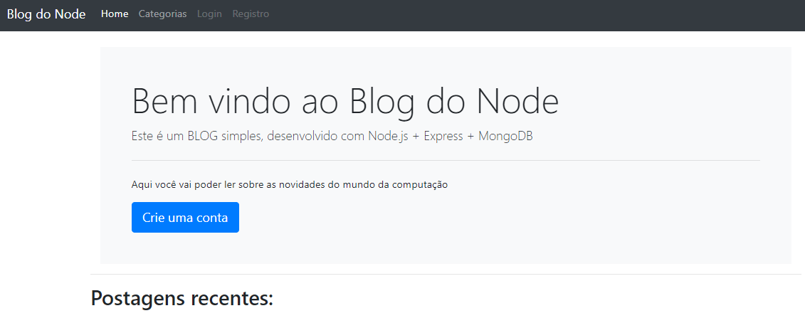

<h1 align="center"> Blog App </h1>

  <a href="#-technologies">Technologies</a>&nbsp;&nbsp;&nbsp;|&nbsp;&nbsp;&nbsp;
  <a href="#-project">Project</a>&nbsp;&nbsp;&nbsp;|&nbsp;&nbsp;&nbsp;
  <a href="#memo-license">License</a>

  

 

  

## 🚀 Technologies

This project was developed with the following technologies:

- HTML e CSS
- JavaScript
- Git e Github
- Node.js
- Express.js
- Sequelize
- MongoDB
- MySql

## 💻 Project

- [Access the playlist course](https://www.youtube.com/playlist?list=PLJ_KhUnlXUPtbtLwaxxUxHqvcNQndmI4B)

## :memo: License

This project is under the MIT license.