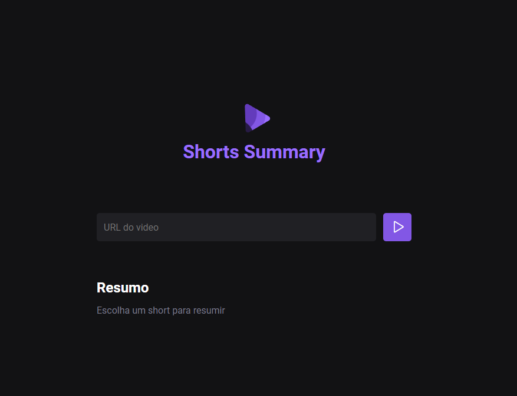

<h1 align="center"> Short-Summary </h1>

O Short-Summary é uma ferramenta para geração de resumos de vídeos curtos do YouTube. Ele permite aos usuários extrair as informações essenciais de vídeos, tornando mais fácil acompanhar o conteúdo sem a necessidade de assistir o vídeo completo. 

  <a href="#-tecnologias">Tecnologias</a>&nbsp;&nbsp;&nbsp;|&nbsp;&nbsp;&nbsp;
  <a href="#-projeto">Projeto</a>&nbsp;&nbsp;&nbsp;|&nbsp;&nbsp;&nbsp;
  <a href="#memo-licença">Licença</a>

  

 

  

## 🚀 Tecnologias

Esse projeto foi desenvolvido com as seguintes tecnologias:

- HTML e CSS
- JavaScript
- Git e Github
- Inteligências Artificiais

## 💻 Projeto

Short Summary é uma plataforma que oferece resumos breves de vídeos curtos do YouTube, economizando seu tempo e destacando o conteúdo mais importante.

## :memo: Licença

Esse projeto está sob a licença MIT.

---
